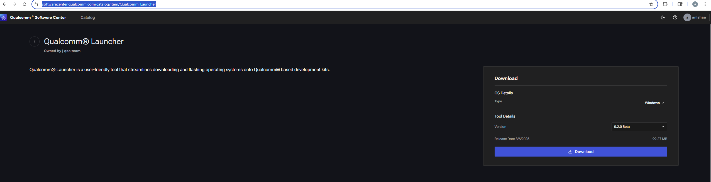
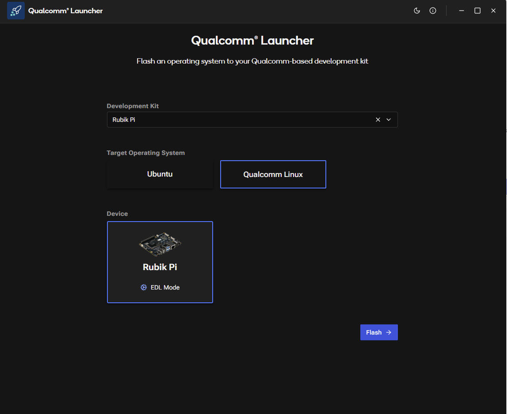
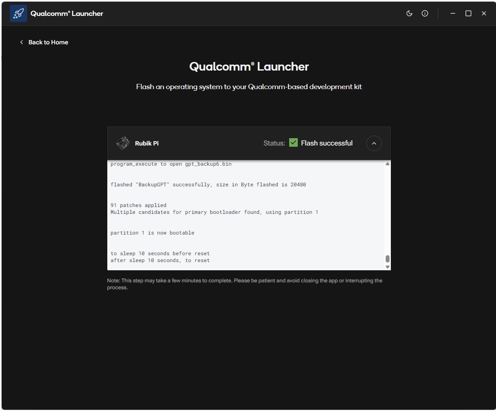

# Updating Software

Below are end user steps (Note: this is AFTER Production release is deployed):

1.  **Download the Installer:**
    Go to the QSC web portal: [https://softwarecenter.qualcomm.com/catalog/item/Qualcomm_Launcher](https://softwarecenter.qualcomm.com/catalog/item/Qualcomm_Launcher)
    OS Type and latest Version are selected by default. Click on "Download" to download the installer.
    
    :::caution
    Make sure you download the correct version for your device.
    :::

    

2.  **Install the Qualcomm Launcher App:**
    Go through the installation process to install the Qualcomm Launcher app.

3.  **Flash the Device:**
    Launch the app. Select "Target Operating system", put your Rubik Pi device in EDL mode (instructions are included in the app), and then click on "Flash".

    
    
    :::info
    EDL (Emergency Download Mode) is a special mode used for flashing devices. Refer to the app's instructions for detailed steps on how to put your device into EDL mode. You can also follow the 
    [advanced updating instructions](../15.update-software.md) if needed.
    :::

4.  **Flashing Process:**
    The app will download the Target OS, unzip it, and flash it onto the connected Rubik Pi device.

    

5.  **Reboot the Device:**
    Once the flashing process is complete, the app will reboot your Rubik Pi device into the new operating system. You can also safetly unplug and replug the device.

6.  **Verify the Update:**
    After the device reboots, you can verify that the update was successful by checking the version number or any other relevant information provided by the app.

    [Set up your device](2.set-up-your-device.md)
    
    :::info
    If you encounter any issues during the update process, you can refer to the [troubleshooting instructions](../13.troubleshooting.md) for assistance
    or the [advanced flashing instructions](../15.update-software.md) for more information.
    :::